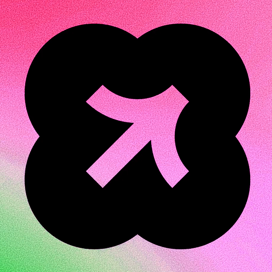

# Zelda Cloud IDE

<p align="center">
  
</p>

Zelda is a browser-based cloud IDE focused on collaborative coding and AI-assisted development. It combines a modern editor experience, real-time data sync, and background AI workflows in a single Next.js application.

## Overview

Zelda provides:

- Workspace and project management
- File explorer and multi-file editing
- CodeMirror-powered editor with language support
- AI suggestions and quick edit actions
- Conversation-driven coding assistant UI
- Real-time persistence with Convex
- Background task processing with Inngest

## Tech Stack

| Layer | Technology |
| --- | --- |
| Frontend | Next.js 16, React 19, TypeScript |
| Styling | Tailwind CSS 4, shadcn/ui, Radix UI |
| Auth | Clerk |
| Database and realtime | Convex |
| AI workflows | AI SDK, Inngest, AgentKit |
| Editor | CodeMirror 6 |
| Monitoring | Sentry |

## Core Features

### Project and File Management

- Create and manage projects
- Hierarchical file and folder operations
- Tab-based file navigation
- Auto-save and optimistic updates

### Code Editing

- Language support for JavaScript, TypeScript, CSS, HTML, JSON, Markdown, and Python
- Minimap, indentation markers, folding, and bracket matching
- Multi-cursor and modern editor ergonomics

### AI Capabilities

- Inline AI code suggestions
- Quick edit flow for selected code (command-style prompt)
- Conversation interface for coding assistance

### Realtime and Async Processing

- Realtime sync through Convex
- Background processing and orchestration through Inngest

## Architecture

High-level request flow:

1. User interacts with the Next.js app UI.
2. UI reads and mutates data via Convex queries and mutations.
3. API routes coordinate AI requests and feature-specific orchestration.
4. Inngest handles long-running or async jobs.
5. Optional external services (AI provider, Firecrawl, Sentry) are used when configured.

## Repository Structure

```text
.
|-- .github/
|   \-- hooks/
|       \-- context-mode.json
|-- .gitignore
|-- .prettierignore
|-- .vscode/
|   \-- mcp.json
|-- README.md
|-- components.json
|-- convex/
|   |-- _generated/
|   |   |-- api.d.ts
|   |   |-- api.js
|   |   |-- dataModel.d.ts
|   |   |-- server.d.ts
|   |   \-- server.js
|   |-- auth.config.ts
|   |-- auth.ts
|   |-- conversations.ts
|   |-- files.ts
|   |-- projects.ts
|   |-- schema.ts
|   \-- system.ts
|-- eslint.config.mjs
|-- examples/
|   |-- .babelrc.example
|   |-- next.config.example.js
|   \-- vite.config.example.ts
|-- next.config.ts
|-- package-lock.json
|-- package.json
|-- postcss.config.mjs
|-- public/
|   |-- zelda-logo-white.ico
|   |-- zelda-logo-white.webp
|   |-- zelda-logo.png
|   \-- zelda-logo.webp
|-- sentry.edge.config.ts
|-- sentry.server.config.ts
|-- src/
|   |-- app/
|   |   |-- api/
|   |   |   |-- github/
|   |   |   |   |-- export/
|   |   |   |   |   |-- cancel/
|   |   |   |   |   |   \-- route.ts
|   |   |   |   |   |-- reset/
|   |   |   |   |   |   \-- route.ts
|   |   |   |   |   \-- route.ts
|   |   |   |   \-- import/
|   |   |   |       \-- route.ts
|   |   |   |-- inngest/
|   |   |   |   \-- route.ts
|   |   |   |-- messages/
|   |   |   |   |-- cancel/
|   |   |   |   |   \-- route.ts
|   |   |   |   \-- route.ts
|   |   |   |-- projects/
|   |   |   |   \-- create-with-prompt/
|   |   |   |       \-- route.ts
|   |   |   |-- quick-edit/
|   |   |   |   \-- route.ts
|   |   |   \-- suggestion/
|   |   |       \-- route.ts
|   |   |-- favicon.ico
|   |   |-- global-error.tsx
|   |   |-- globals.css
|   |   |-- layout.tsx
|   |   |-- page.tsx
|   |   \-- projects/
|   |       |-- [projectId]/
|   |       |   |-- layout.tsx
|   |       |   \-- page.tsx
|   |       |-- layout.tsx
|   |       \-- page.tsx
|   |-- components/
|   |   |-- ai-elements/
|   |   |   |-- artifact.tsx
|   |   |   |-- canvas.tsx
|   |   |   |-- chain-of-thought.tsx
|   |   |   |-- checkpoint.tsx
|   |   |   |-- code-block.tsx
|   |   |   |-- confirmation.tsx
|   |   |   |-- connection.tsx
|   |   |   |-- context.tsx
|   |   |   |-- controls.tsx
|   |   |   |-- conversation.tsx
|   |   |   |-- edge.tsx
|   |   |   |-- image.tsx
|   |   |   |-- inline-citation.tsx
|   |   |   |-- loader.tsx
|   |   |   |-- message.tsx
|   |   |   |-- model-selector.tsx
|   |   |   |-- node.tsx
|   |   |   |-- open-in-chat.tsx
|   |   |   |-- panel.tsx
|   |   |   |-- plan.tsx
|   |   |   |-- prompt-input.tsx
|   |   |   |-- queue.tsx
|   |   |   |-- reasoning.tsx
|   |   |   |-- shimmer.tsx
|   |   |   |-- sources.tsx
|   |   |   |-- suggestion.tsx
|   |   |   |-- task.tsx
|   |   |   |-- tool.tsx
|   |   |   |-- toolbar.tsx
|   |   |   \-- web-preview.tsx
|   |   |-- home-navbar.tsx
|   |   |-- providers.tsx
|   |   |-- theme-provider.tsx
|   |   |-- theme-toggle.tsx
|   |   \-- ui/
|   |       |-- accordion.tsx
|   |       |-- alert-dialog.tsx
|   |       |-- alert.tsx
|   |       |-- aspect-ratio.tsx
|   |       |-- avatar.tsx
|   |       |-- badge.tsx
|   |       |-- breadcrumb.tsx
|   |       |-- button-group.tsx
|   |       |-- button.tsx
|   |       |-- calendar.tsx
|   |       |-- card.tsx
|   |       |-- carousel.tsx
|   |       |-- chart.tsx
|   |       |-- checkbox.tsx
|   |       |-- collapsible.tsx
|   |       |-- command.tsx
|   |       |-- context-menu.tsx
|   |       |-- dialog.tsx
|   |       |-- drawer.tsx
|   |       |-- dropdown-menu.tsx
|   |       |-- empty.tsx
|   |       |-- field.tsx
|   |       |-- form.tsx
|   |       |-- hover-card.tsx
|   |       |-- input-group.tsx
|   |       |-- input-otp.tsx
|   |       |-- input.tsx
|   |       |-- item.tsx
|   |       |-- kbd.tsx
|   |       |-- label.tsx
|   |       |-- menubar.tsx
|   |       |-- navigation-menu.tsx
|   |       |-- pagination.tsx
|   |       |-- popover.tsx
|   |       |-- progress.tsx
|   |       |-- radio-group.tsx
|   |       |-- scroll-area.tsx
|   |       |-- select.tsx
|   |       |-- separator.tsx
|   |       |-- sheet.tsx
|   |       |-- sidebar.tsx
|   |       |-- skeleton.tsx
|   |       |-- slider.tsx
|   |       |-- sonner.tsx
|   |       |-- spinner.tsx
|   |       |-- switch.tsx
|   |       |-- table.tsx
|   |       |-- tabs.tsx
|   |       |-- textarea.tsx
|   |       |-- toggle-group.tsx
|   |       |-- toggle.tsx
|   |       \-- tooltip.tsx
|   |-- features/
|   |   |-- auth/
|   |   |   \-- components/
|   |   |       |-- auth-loading-view.tsx
|   |   |       \-- unauthenticated-view.tsx
|   |   |-- conversations/
|   |   |   |-- components/
|   |   |   |   |-- conversation-sidebar.tsx
|   |   |   |   \-- past-conversations-dialog.tsx
|   |   |   |-- constants.ts
|   |   |   |-- hooks/
|   |   |   |   \-- use-conversations.ts
|   |   |   \-- inngest/
|   |   |       |-- constants.ts
|   |   |       |-- process-message.ts
|   |   |       \-- tools/
|   |   |           |-- create-files.ts
|   |   |           |-- create-folder.ts
|   |   |           |-- delete-files.ts
|   |   |           |-- list-files.ts
|   |   |           |-- read-files.ts
|   |   |           |-- rename-file.ts
|   |   |           |-- scrape-urls.ts
|   |   |           \-- update-file.ts
|   |   |-- editor/
|   |   |   |-- components/
|   |   |   |   |-- code-editor.tsx
|   |   |   |   |-- editor-view.tsx
|   |   |   |   |-- file-breadcrumbs.tsx
|   |   |   |   \-- top-navigation.tsx
|   |   |   |-- extensions/
|   |   |   |   |-- custom-setup.ts
|   |   |   |   |-- language-extension.ts
|   |   |   |   |-- minimap.ts
|   |   |   |   |-- quick-edit/
|   |   |   |   |   |-- fetcher.ts
|   |   |   |   |   \-- index.ts
|   |   |   |   |-- selection-tooltip.ts
|   |   |   |   |-- suggestion/
|   |   |   |   |   |-- fetcher.ts
|   |   |   |   |   \-- index.ts
|   |   |   |   \-- theme.ts
|   |   |   |-- hooks/
|   |   |   |   \-- use-editor.ts
|   |   |   \-- store/
|   |   |       \-- use-editor-store.ts
|   |   |-- landing/
|   |   |   \-- components/
|   |   |       |-- faq.tsx
|   |   |       |-- feature-section.tsx
|   |   |       |-- final-cta.tsx
|   |   |       |-- hero.tsx
|   |   |       |-- how-it-works.tsx
|   |   |       |-- landing-content.ts
|   |   |       |-- landing-footer.tsx
|   |   |       |-- landing-motion.ts
|   |   |       |-- landing-navbar.tsx
|   |   |       |-- landing-page.tsx
|   |   |       |-- proof-strip.tsx
|   |   |       |-- scroll-reveal.tsx
|   |   |       |-- scroll-to-top.tsx
|   |   |       |-- showcase.tsx
|   |   |       \-- use-cases.tsx
|   |   |-- preview/
|   |   |   |-- components/
|   |   |   |   |-- draggable-terminal.tsx
|   |   |   |   |-- preview-settings-popover.tsx
|   |   |   |   \-- preview-terminal.tsx
|   |   |   |-- hooks/
|   |   |   |   \-- use-webcontainer.ts
|   |   |   \-- utils/
|   |   |       |-- file-tree.ts
|   |   |       |-- framework-auto-fix.ts
|   |   |       |-- framework-configs.ts
|   |   |       \-- framework-detector.ts
|   |   \-- projects/
|   |       |-- components/
|   |       |   |-- export-popover.tsx
|   |       |   |-- file-explorer/
|   |       |   |   |-- constants.ts
|   |       |   |   |-- create-input.tsx
|   |       |   |   |-- index.tsx
|   |       |   |   |-- loading-row.tsx
|   |       |   |   |-- rename-input.tsx
|   |       |   |   |-- tree-item-wrapper.tsx
|   |       |   |   \-- tree.tsx
|   |       |   |-- import-github-dialog.tsx
|   |       |   |-- navbar.tsx
|   |       |   |-- new-project-dialog.tsx
|   |       |   |-- preview-view.tsx
|   |       |   |-- project-id-layout.tsx
|   |       |   |-- project-id-view.tsx
|   |       |   |-- projects-command-dialog.tsx
|   |       |   |-- projects-list.tsx
|   |       |   \-- projects-view.tsx
|   |       |-- hooks/
|   |       |   |-- use-files.ts
|   |       |   \-- use-projects.ts
|   |       \-- inngest/
|   |           |-- export-to-github.ts
|   |           \-- import-github-repo.ts
|   |-- hooks/
|   |   \-- use-mobile.ts
|   |-- inngest/
|   |   |-- client.ts
|   |   \-- functions.ts
|   |-- instrumentation-client.ts
|   |-- instrumentation.ts
|   |-- lib/
|   |   |-- chat-events.ts
|   |   |-- convex-client.ts
|   |   |-- firecrawl.ts
|   |   \-- utils.ts
|   \-- proxy.ts
\-- tsconfig.json

```

## Getting Started

### Prerequisites

- Node.js 20+
- npm
- Accounts and API keys for Clerk and Convex
- At least one AI provider key (Gemini or OpenRouter)

### 1. Clone and install

```bash
git clone https://github.com/Devil-2621/zelda-cloud-ide.git
cd zelda-cloud-ide
npm install
```

### 2. Configure environment

Create your environment file from the template:

```bash
cp .env.example .env.local
```

Then update `.env.local` with your values.

## Environment Variables

The project ships with `.env.example`. Important variables are grouped below.

### Clerk

- `NEXT_PUBLIC_CLERK_PUBLISHABLE_KEY`
- `CLERK_SECRET_KEY`
- `NEXT_PUBLIC_CLERK_SIGN_IN_URL`
- `NEXT_PUBLIC_CLERK_SIGN_IN_FALLBACK_REDIRECT_URL`
- `NEXT_PUBLIC_CLERK_SIGN_UP_URL`
- `NEXT_PUBLIC_CLERK_SIGN_UP_FALLBACK_REDIRECT_URL`

### Convex

- `CONVEX_DEPLOYMENT`
- `NEXT_PUBLIC_CONVEX_URL`
- `NEXT_PUBLIC_CONVEX_SITE_URL`
- `ZELDA_CONVEX_INTERNAL_KEY`

### AI Providers

- `GOOGLE_GEMINI_API_KEY`
- `OPENROUTER_AI_API_KEY`

### Optional Integrations

- `FIRECRAWL_API_KEY`
- `SENTRY_AUTH_TOKEN`

## Running Locally

Use three terminals during development.

### Terminal 1: Convex

```bash
npx convex dev
```

### Terminal 2: Next.js app

```bash
npm run dev
```

### Terminal 3: Inngest dev server

```bash
npx inngest-cli@latest dev
```

Open `http://localhost:3000` after the services are running.

## Scripts

```bash
npm run dev      # Start Next.js in development
npm run build    # Create production build
npm run start    # Start production server
npm run lint     # Run ESLint checks
```

## API Surface (High Level)

API handlers are located in `src/app/api`.

- `messages`: conversation/message processing
- `suggestion`: inline suggestion generation
- `quick-edit`: prompt-based edit actions
- `projects`: project-level APIs
- `github`: GitHub integration endpoints (where configured)
- `inngest`: event and workflow hooks

Convex backend modules live in `convex/` and provide the data layer for projects, files, and conversations.

## Development Notes

- This project uses App Router and modern React patterns.
- Styling tokens and global theme variables are managed in `src/app/globals.css`.
- Theme behavior is wired through `next-themes` provider in `src/components/providers.tsx`.

## Troubleshooting

### App starts but data does not load

- Verify Convex is running and `NEXT_PUBLIC_CONVEX_URL` is correct.
- Confirm `CONVEX_DEPLOYMENT` and `ZELDA_CONVEX_INTERNAL_KEY` are set.

### Authentication is not working

- Check Clerk keys and callback URLs.
- Confirm Clerk URLs in `.env.local` match your app routes.

### AI features return errors

- Ensure at least one provider key is present.
- Check server logs for provider quota or auth failures.

### Inngest jobs do not process

- Verify Inngest dev server is running.
- Check the `src/inngest/functions.ts` registrations and event flow.

## Status

Zelda is actively evolving. Some advanced features (for example full agent-driven file modification, complete preview/runtime flow, and broader GitHub workflows) may still be under active development depending on the branch and local configuration.

## License

This repository is distributed under the **Tech Tuition System LLP Proprietary License v1.0**.

- Full license text: [LICENSE](LICENSE)
- Copyright owner: **Tech Tuition System LLP**
- Rights status: **All rights reserved**

Note: an all-rights-reserved license is proprietary and is not an OSI-approved open-source license.

